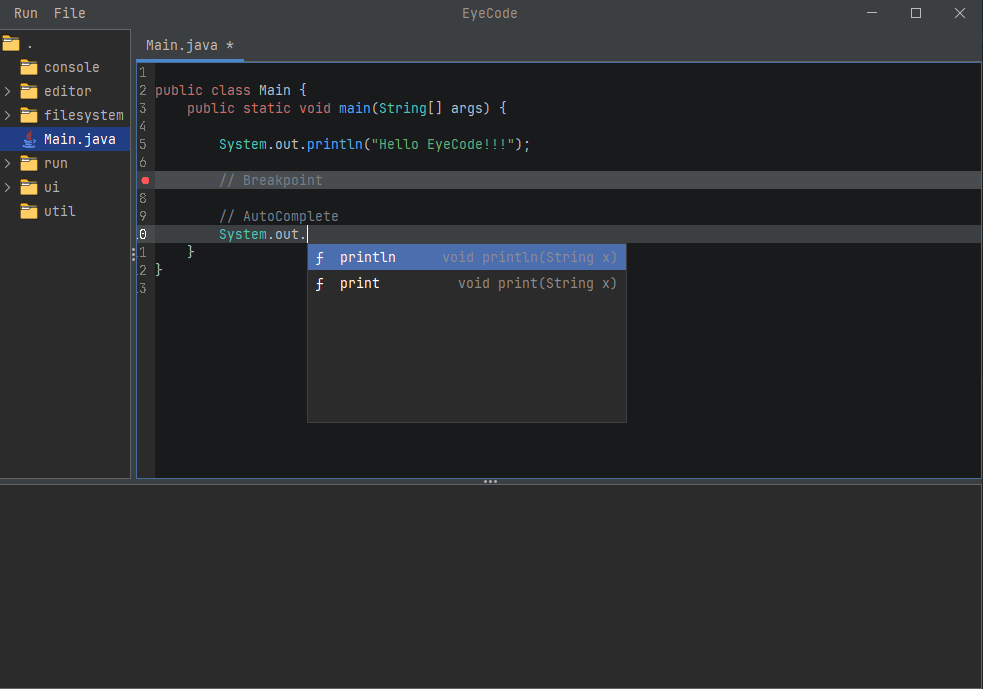

<div align="center">

# EyeCode

### See deeper. Build better.

Lightweight Java IDE built from scratch with Swing, inspired by IntelliJ IDEA.

<br>


</div>

---


## Preview

<p align="center">
  
</p>

<p align="center">
  
  
  
  
</p>

---

## About

EyeCode is a custom lightweight IDE developed entirely in Java using Swing.

The project was built to explore how professional development tools work internally: text editors, syntax engines, autocomplete systems, breakpoints, keyboard interactions, and desktop UI architecture.

Inspired by IntelliJ IDEA, EyeCode combines technical curiosity with practical software engineering.

More than an editor, this project is a hands-on study of how real tools are designed.

---

## Features

| Feature | Description |
|--------|-------------|
| 🧠 Smart Autocomplete | Context-aware suggestions with keyboard navigation |
| 🎨 Syntax Highlighting | IntelliJ-inspired token coloring for Java |
| 🔴 Breakpoints | Click gutter to toggle breakpoints visually |
| 📏 Line Numbers | Dynamic synchronized line numbering |
| ⌨️ Auto Indentation | Smart indentation for blocks and braces |
| 🌙 Dark Theme | Clean UI inspired by modern JetBrains IDEs |
| 📁 File Explorer | Browse and open project files easily |
| ⚡ Fast Editing | Lightweight editor built with Swing |

---

### Current Development Focus

- [x] Editor Core
- [x] UI Theme
- [x] Highlight Engine
- [x] Autocomplete
- [ ] Semantic Parsing
- [ ] Compiler Panel
- [ ] Run Button


---
### Package Structure
```md id="g8q2ls"


```EyeCode
ide.java
├── console        # output / logs
├── editor         # document model
├── filesystem     # file handling
├── run            # execution manager
├── ui             # visual components
├── util           # helpers
└── Main.java      # application entry point
```
---

## Challenges Solved

Building EyeCode required solving several real-world editor problems:

| Challenge | Solution |
|----------|----------|
| ⌨️ Autocomplete popup blocking typing | Reworked focus and key event handling |
| ↩️ Enter / Tab conflicts | Custom key bindings with context-aware behavior |
| 🎨 Syntax highlight overlap | Improved token rendering priority |
| 📏 Full-width line highlight | Custom painter implementation |
| 🔤 Font fallback issues | Explicit JetBrains Mono loading |
| 🔴 Breakpoint rendering | Interactive gutter state management |
| ⚡ Real-time updates | Optimized listeners and repaint flow |

---

## What I Learned

Building EyeCode helped me develop practical knowledge in:

- Java Swing desktop architecture
- Event-driven programming
- Custom rendering and painting
- Keyboard input systems
- Syntax highlighting logic
- Autocomplete workflows
- File system integration
- UI/UX thinking for developer tools
- Debugging complex interactions
- Structuring maintainable codebases

- ---

## Roadmap

### Core Editor

- [x] Custom text editor
- [x] Syntax highlighting
- [x] Auto indentation
- [x] Breakpoints
- [x] Line numbers
- [x] Dark theme

### Smart Features

- [x] Basic autocomplete
- [ ] Context-aware autocomplete
- [ ] Method signatures tooltip
- [ ] Import suggestions
- [ ] Snippet expansion

### Runtime Tools

- [x] Console panel
- [x] Run manager
- [ ] Build button
- [ ] Error navigation
- [ ] Integrated terminal

### Advanced Goals

- [ ] Project tabs
- [ ] Search / Replace
- [ ] Mini-map
- [ ] Plugin system
- [ ] LSP integration

---

## Installation

### Requirements

- Java 21+
- IntelliJ IDEA (recommended) or any Java IDE

### Run Locally

```bash
git clone https://github.com/natanhnrqe/EyeCode.git
cd EyeCode
```
Open the project in IntelliJ IDEA and run Main.java.

## Author

**Natan Henrique**

- GitHub: https://github.com/natanhnrqe
- LinkedIn: https://linkedin.com/in/natannhenriquee

---

<div align="center">

### Built with Java, curiosity, and craftsmanship.

</div>
