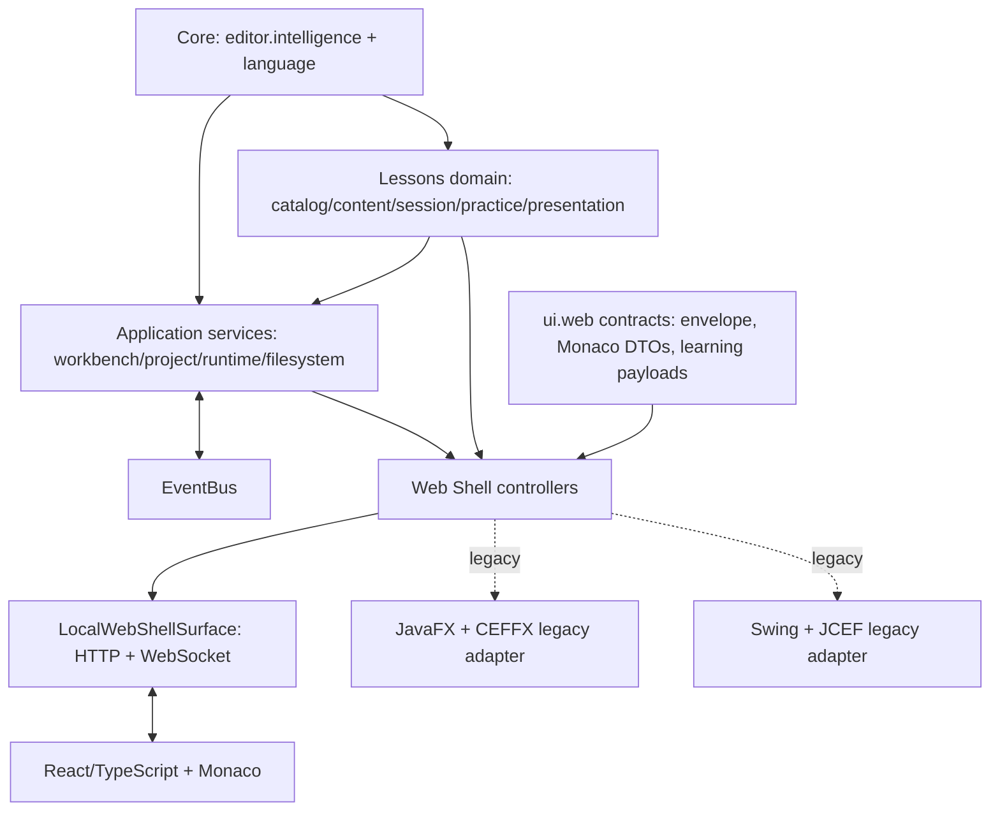
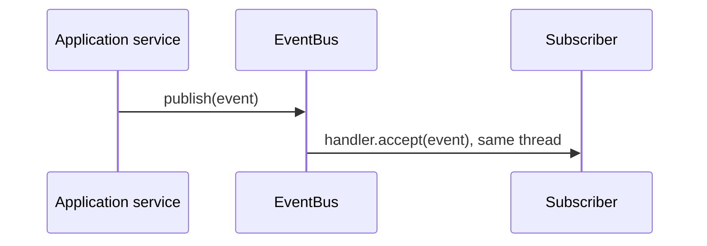
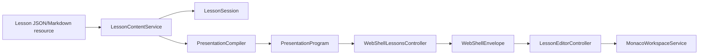

# EyeCode Architecture

## 1. Objetivo arquitetural

EyeCode é uma IDE Web de aprendizado de Java. A regra que governa sua arquitetura é simples: os motores de edição, linguagem e apresentações não conhecem detalhes de interface. React/Web é o caminho principal; Swing, JavaFX/CEFFX e JCEF são adapters legados, não dependências do backend Web.

O projeto ainda contém código de diferentes gerações. Esta documentação descreve a estrutura efetiva, inclusive limites legados, em vez de apresentar uma arquitetura idealizada.

## 2. Visão geral



`src/main/web` is the source of truth for the React bundle. `src/main/resources/webshell` is generated runtime output and must never be edited as architecture source.

## 3. Componentes principais

| Área | Responsabilidade | Principais pontos de entrada | Classificação |
| --- | --- | --- | --- |
| `editor.intelligence` | Documento, caret, seleção, indentação e Smart Editing sem toolkit | `DocumentSnapshot`, `TypingPipeline`, `JavaIndentPolicy` | Core |
| `language` | Lexer, parser, AST, CFG, semântica e JDK source resolution | `JavaLexerService`, `JavaParserService`, `DefinitionAtCaretResolver` | Core |
| `lessons` | Catálogo, conteúdo, sessão, prática e programas de apresentação | `LessonContentService`, `LessonSession`, `PresentationCompiler` | Domain |
| `workbench`, `project`, `runtime`, `filesystem` | Ciclo do editor, workspace, execução e I/O | `EditorManager`, `ProjectLifecycleService`, `RunService` | Application/infrastructure |
| `eventbus` | Eventos internos em processo | `EventBus`, `Event`, `SubscriptionToken` | Shared infrastructure |
| `ui.web` | Contratos, controllers, surfaces, asset server e bridge do Web Shell | `WebShellWorkspaceController`, `WebShellSurface`, `WebShellEnvelope` | Web adapter |
| `ui.web.monaco` | DTOs e serviços sem toolkit para a conversa Java ↔ Monaco | `MonacoCommand`, `MonacoEvent`, `MonacoModelId`, `EyeCodeCompletionService` | Web contract |
| `ui.web.learning` | Payload Web de Learn e classificação compartilhada de tamanho | `MonacoLearningOverlayPayload`, `LearningCardSizingPolicy` | Web contract |
| `javafx` | Composição desktop JavaFX/CEFFX preservada | `FxApplication`, `FxMainWindow`, `JavaFxMonacoEditorSurface` | Legacy adapter |
| `swing`, `ui`, `editor.v2.ui` | Aplicação e componentes Swing preservados | `SwingMainWindow`, `MainWindow`, `RichEditorView` | Legacy UI |
| `src/main/web` | React, estado de workspace, bridge e renderização Monaco | `EyeCodeBridge`, `MonacoWorkspaceService`, `LessonEditorController` | React/Web UI |

## 4. Dependency Rules

| De | Pode depender de | Não pode depender de |
| --- | --- | --- |
| Core (`editor.intelligence`, `language`) | JDK, outros contratos Core | Swing, JavaFX, CEFFX, JCEF, React, Web Shell |
| Lessons | Core e modelos de conteúdo | Monaco, superfícies Web, Swing, JavaFX |
| Application/infrastructure | Core, Lessons, EventBus | Renderização concreta quando um contrato é suficiente |
| `ui.web.monaco`, `ui.web.learning` | Core/Lessons necessários ao payload | Swing, JavaFX, CEFFX, JCEF |
| Web controllers | Application, Lessons e contratos Web | Tipos concretos de Swing/JavaFX |
| JavaFX e Swing | Application, Lessons e contratos Web | A implementação da outra UI |
| React | Tipos de protocolo, bridge e serviços frontend | Classes Java ou detalhes nativos |

Essas regras são protegidas por `ArchitectureBoundaryTest`. O teste verifica Core/Lessons sem imports de UI, contratos/controladores Web sem imports de toolkit e ausência de imports diretos Swing ↔ JavaFX.

## 5. Arquitetura das UIs

### Swing

Swing é compatibilidade legada. `com.eyecode.swing.SwingMainWindow` compõe `SwingWebShellSurface`, `SwingWebShellNativeUi` e `WebShellWorkspaceController`. A surface contém somente ciclo de vida JCEF/AWT; as mensagens e a lógica de workspace continuam no Web Shell compartilhado.

`com.eyecode.ui` e partes de `editor.v2.ui` ainda contêm telas Swing históricas. Elas não definem APIs para Core novo.

### Runtime Web principal

`LocalWebShellLauncher` é o composition root principal. Ele cria `LocalWebShellSurface` e `WebShellWorkspaceController` com `WebShellNativeUi.unavailable()`. A surface sobe HTTP e WebSocket em loopback, injeta a configuração de bootstrap/token no frontend empacotado e publica sua URL. React usa `EyeCodeBridge` e `LocalWebSocketTransport`; Monaco continua no frontend.

`java.awt.Desktop` está isolado em `LocalWebShellBrowserOpener` e só é usado quando `eyecode.web.openBrowser=true`. Sua indisponibilidade não interrompe o backend.

Seleção nativa de diretório/arquivo não existe no runtime Web ainda: operações que exigem picker retornam `NATIVE_UI_UNAVAILABLE`; abrir projeto com caminho explícito continua disponível.

### JavaFX

JavaFX é um adapter desktop legado. `FxApplication` inicia `FxMainWindow`, que hospeda `JavaFxWebShellSurface` via CEFFX. `JavaFxMonacoEditorSurface` continua em `com.eyecode.javafx.monaco` porque é a implementação visual JavaFX/CEFFX; seus comandos, eventos, IDs e DTOs agora estão em `com.eyecode.ui.web.monaco`.

`JavaFxWebDocumentationHost` implementa `WebShellDocumentationHost`. Com isso, o controller compartilhado não referencia mais a classe JavaFX concreta para abrir, ocultar ou posicionar documentação.

### React/Web

O frontend React vive em `src/main/web/src`:

- `bridge/EyeCodeBridge.ts`: único bridge de envelopes para CEFFX ou WebSocket local;
- `bridge/protocol.ts`: representação TypeScript de `eyecode.web/1`;
- `workspace/` e `document/`: composição e estado da área de trabalho;
- `monaco/MonacoWorkspaceService.ts`: renderização Monaco, apresentação, highlight e recuperação visual;
- `lessons/`: catálogo, painel, player e controle de lesson.

Componentes React devem solicitar ações pelo `bridge` ou por um serviço já existente. Não devem construir transportes CEFFX diretamente.

### Transporte Web principal e adapters legados

`LocalWebShellSurface` é o transporte principal: serve o bundle React por HTTP loopback e recebe/envia `WebShellEnvelope` por WebSocket loopback, sem mudar o protocolo `eyecode.web/1`. Em desenvolvimento, `npm run dev` serve Vite em `127.0.0.1:5173`; o launcher publica o bootstrap autorizado para essa origem. `JavaFxWebShellSurface` e `SwingWebShellSurface` preservam o mesmo envelope em transports nativos legados.

## 6. Web Shell e ownership de protocolo

O antigo package `com.eyecode.javafx.web` misturava Web Shell, Swing e JavaFX sob uma UI específica. Ele foi movido para `com.eyecode.ui.web`, seu domínio real.

| Subárea | Ownership |
| --- | --- |
| `ui.web` | controllers, `WebShellSurface`, dispatcher, envelope, codecs, assets e transports |
| `ui.web.monaco` | contrato Java ↔ Monaco/React e transformação de completion |
| `ui.web.learning` | payload de Learn consumido por overlay Web e classificação de tamanho |
| `javafx.monaco` | implementação visual `JavaFxMonacoEditorSurface` e parser interno CEFFX |
| `swing` / JavaFX | adapters nativos que implementam `WebShellSurface` ou `WebShellNativeUi` |

`WebShellEnvelope` é um **WEB CONTRACT**, não um DTO de Core. Ele tem protocolo fixo `eyecode.web/1`, `kind` (`request`, `response`, `event`), `channel`, `name`, correlação por `requestId` e `payload`. A semântica do payload pertence ao handler do par `channel/name`.

`WebShellDispatcher` faz dispatch exato desse par. Handler desconhecido gera `UNKNOWN_COMMAND` apenas para requests. `WebShellProtocolCodec` valida versão e kind do envelope; cada controller valida seu payload.

## 7. EventBus

`EventBus` é um barramento em memória, síncrono e de ownership da composição da aplicação. Ele não é transporte Web e não serializa eventos.



Contratos reais:

- O roteamento usa o tipo de runtime exato; não há herança/polimorfismo de eventos.
- Handlers executam em ordem de assinatura no thread do publisher.
- Uma exceção do handler propaga ao publisher e interrompe handlers posteriores.
- `subscribe` retorna `SubscriptionToken`; o dono do subscriber deve chamar `unsubscribe` durante seu ciclo de vida.
- Implementação usa coleções concorrentes, mas não introduz agendamento, isolamento de falhas nem EventBus global adicional.

Exemplos ativos incluem `DocumentTextChangeEvent` → `LexerEventBridge`/`ParserEventBridge` → `TokensUpdatedEvent`/`ParserSnapshotUpdatedEvent`, e `ProjectRefreshEvent` → `ProjectRefreshService`. Eventos de UI históricos continuam em `eventbus.events`.

## 8. Learn e Presentation Architecture



Lesson resources declare `canonicalCode` and transition intent. They do not declare Monaco edit commands, ranges, line/column coordinates or typing cadence. `PresentationCompiler` analyzes canonical states and creates a `PresentationProgram`; it materializes the target if a planned program cannot reproduce the exact canonical code. `MonacoWorkspaceService` renders the resulting operations and verifies/recoveries to the canonical state.

Practice remains owned by `LessonSession`/lesson models and is reached through `WebShellLessonsController`; the frontend only renders the supplied state and sends verification actions.

## 9. Project and runtime architecture

`ProjectLifecycleService` owns the active project and listener lifecycle. `EditorManager` owns editor sessions, autosave wiring and document events. `ProjectFileOperationService` and `MavenProjectCreationService` perform file/project actions. `RunService` owns run state and delegates terminal concerns to `TerminalService`.

`WebShellWorkspaceController` adapts these existing services to Web channels (`workspace`, `document`, `run`, `terminal`) and publishes their state as Web events. It does not own a different project, run or editor model.

## 10. Runtime flows

### Startup

1. `LocalWebShellLauncher` creates `LocalWebShellSurface` and its loopback HTTP/WebSocket endpoints.
2. `WebShellWorkspaceController` registers the shared channel handlers on `WebShellSurface` with unavailable native-window capabilities.
3. The launcher prints the URL; the browser loads React and receives the injected local bootstrap/token.
4. React opens `LocalWebSocketTransport`, sends `shell/ready`, receives bootstrap state and uses `EyeCodeBridge`.

### Open project

1. React requests `workspace/openProject`.
2. `WebShellWorkspaceController` delegates to `ProjectLifecycleService`.
3. The controller projects workspace and document state into response/events.
4. React updates its workspace view and Monaco models.

### Run

1. React requests `run/run` or `run/rerun`.
2. The Web controller flushes through the configured `RunService` path.
3. Run phase/state and output are sent as `run/state` and `run/output` events.
4. React renders structured state; it must not infer run state by parsing output text.

### Open lesson / next presentation

1. React requests a `lessons/*` command.
2. `WebShellLessonsController` opens or advances `LessonSession`.
3. The compiled presentation program is sent in a typed lesson payload.
4. `LessonEditorController` asks `MonacoWorkspaceService` to play it.

## 11. Extension points

| Need | Extension point |
| --- | --- |
| New document/language behavior | Core service under `editor.intelligence` or `language` |
| New lesson presentation quality rule | `PresentationTransitionPlanner`/presentation operation logic, only if canonical transition analysis needs it |
| New lesson | resource + lesson catalog/content model; no Monaco ranges in the resource |
| New Web command | `WebShellSurface.registerHandler` through the owning `WebShell*Controller` |
| New Web event | `WebShellEnvelope.event(channel, name, payload)` and matching frontend subscription/service |
| New native window capability | add it to `WebShellNativeUi`, implement in each native adapter only when both need it |
| New EventBus event | immutable `Event` plus publisher and explicit subscriber lifecycle |

## 12. Deprecated and legacy architecture

| Class/API | Status | Evidence / replacement | Action |
| --- | --- | --- | --- |
| `LearningChromiumView` | DEPRECATED | Existing `@Deprecated(forRemoval = true)` Swing/JCEF learning view; active UI uses Web Shell/JavaFX composition | Do not add callers; remove only after the old document view is retired |
| `LearningDocumentView` | DEPRECATED | Existing Swing learning document wrapper over `LearningChromiumView` | Do not add callers |
| `MarkdownToHtmlConverter` | DEPRECATED | Existing custom Markdown renderer; `FlexmarkConverter` is the maintained rendering path | Do not add callers |
| `BrowserManager#getClient()` | DEPRECATED | Existing API annotation; callers should create clients through `createClient()` | Do not add callers |
| `LearningWebView` | LEGACY_BUT_REQUIRED | Swing fallback class retained in source; no substitute annotation was added because compatibility intent is not fully proven | Keep documented; reassess with callers/runtime configuration |
| `SwingMainWindow`, `ui.MainWindow` | LEGACY_BUT_REQUIRED | Supported Swing compatibility entrypoints | Preserve behavior |
| `SwingWebShellSpike` | UNCERTAIN | No production references, but it has a standalone `main` and may be used manually for JCEF diagnosis | Do not remove automatically |
| `chromium.demo` | UNCERTAIN | Demo classes compile and exercise deprecated browser APIs; no runtime launcher was found in normal startup | Keep until manual/debug workflow is confirmed obsolete |

No code was removed in this audit: lack of IDE callers is not sufficient evidence when manual entrypoints, native callbacks and resource loading exist.

## 13. SOLID audit and known debt

| Principle | Finding | Resolution or status |
| --- | --- | --- |
| S — Single Responsibility | `WebShellWorkspaceController` coordinates documents, workspace, run, terminal, JDK source and native documentation. | **Known debt.** These handlers share session/lifecycle state, and splitting them now would be a behavior-bearing change. New unrelated concerns must not be added there; extract an aggregate controller only with targeted flow tests. |
| O — Open/Closed | Web commands are extensible through handler registration rather than a global switch. Presentation compilation falls back safely when a plan is not exact. | No artificial strategy/factory added. |
| L — Liskov | `WebShellSurface` implementations preserve send/register semantics; `WebShellNativeUi.unavailable()` is an explicit null object rather than a partial subtype throwing unsupported-operation errors. | No concrete violation found in these boundaries. |
| I — Interface Segregation | `WebShellSurface` has two transport operations. `WebShellDocumentationHost` separates documentation placement from the broader native-window capability. | **Corrected:** Web Shell controller no longer accepts a JavaFX documentation class. |
| D — Dependency Inversion | Shared Web controller previously referenced JavaFX-specific surface/documentation types; shared Monaco/Learn payload contracts lived under `javafx.*`. | **Corrected:** controller depends on `WebShellSurface`/`WebShellDocumentationHost`; toolkit-free Monaco and Learn Web contracts moved to `ui.web.*`. |

`WebShellWorkspaceController` still constructs several application services directly. It is an adapter-side composition concern rather than a Core → UI dependency, but it remains the largest architectural debt. It was deliberately documented rather than refactored without a dedicated behavior-preserving migration.

## 14. Architectural invariants

- Core and Lessons do not import UI toolkits or Web implementation.
- Canonical lesson code is authoritative; presentation programs must end at the exact canonical target.
- Web protocol version is `eyecode.web/1` until a deliberate compatible migration is made.
- One application-owned EventBus is passed to participants; do not create feature-local global buses.
- Swing and JavaFX may use shared Web contracts but do not directly import one another.
- React renders state and sends bridge messages; it does not own Java parsing, project lifecycle or lesson transition decisions.
- Generated `src/main/resources/webshell` assets are output of `src/main/web`.

## 15. Testing architecture

| Scope | Tests / command |
| --- | --- |
| Boundaries | `ArchitectureBoundaryTest` |
| Web protocol/controllers | `WebShell*Test`, local transport and asset-server tests |
| Learn/presentation | `PresentationCompilerTest`, `WebShellLessonsControllerTest`, lesson resource tests |
| Monaco contracts | `ui.web.monaco` tests plus `JavaFxMonacoEditorSurfaceTest` |
| Full Java suite | `mvn test` |
| Frontend type safety | `npm run typecheck` in `src/main/web` |
| Frontend bundle | `npm run build` in `src/main/web` |

## 16. Package map

```text
com.eyecode
├── editor.intelligence       toolkit-neutral editor Core
├── language                  toolkit-neutral language Core
├── lessons                   lesson domain and presentation compiler
├── eventbus                  synchronous in-process event infrastructure
├── workbench/project/runtime application and infrastructure services
├── ui.web                    Web Shell adapter and transport contracts
│   ├── monaco                Java ↔ Monaco contract and completion adapter
│   └── learning              Learn payload contract for Web overlays
├── javafx                    active JavaFX / CEFFX UI implementation
│   └── monaco                JavaFX Monaco visual surface only
├── swing                     legacy Swing compatibility shell
└── ui, editor.v2.ui          remaining legacy Swing UI
```

The remaining top-level packages (`autosave`, `browser`, `chromium`, `command`, `designsystem`, `diag`, `diagnostics`, `explorer`, `maven`, `run`, `terminal`, `spike`) are supporting or legacy areas. They should be placed only after a behavior-specific migration, not moved for directory symmetry.
