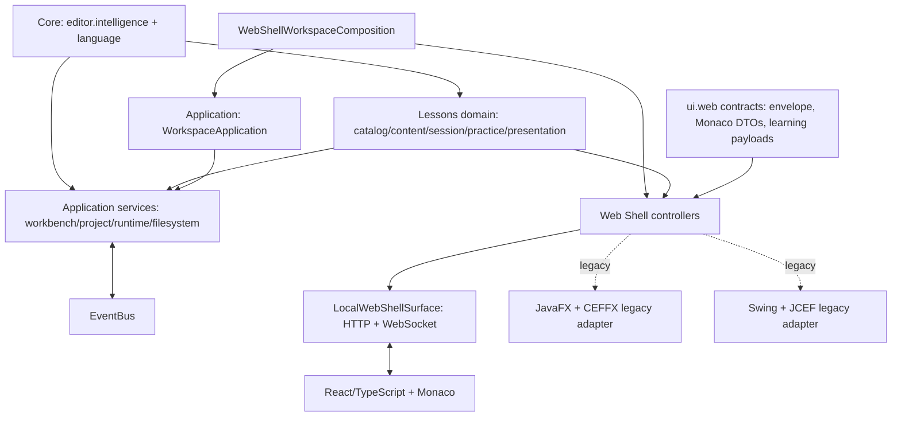
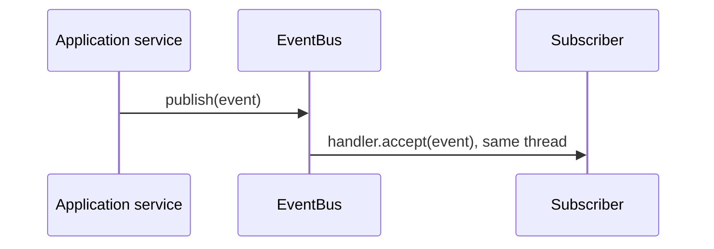
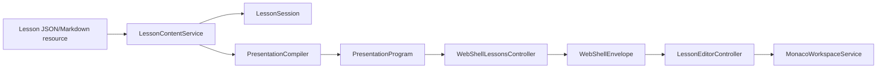

# EyeCode Architecture

## 1. Objetivo arquitetural

EyeCode é uma IDE Web de aprendizado de Java. A regra que governa sua arquitetura é simples: os motores de edição, linguagem e apresentações não conhecem detalhes de interface. React/Web é o caminho principal; Swing, JavaFX/CEFFX e JCEF são adapters legados, não dependências do backend Web.

O projeto ainda contém código de diferentes gerações. Esta documentação descreve a estrutura efetiva, inclusive limites legados, em vez de apresentar uma arquitetura idealizada.

## 2. Visão geral



`src/main/web` is the source of truth for the React bundle. `src/main/resources/webshell` is generated runtime output and must never be edited as architecture source.

## 3. Componentes principais

| Área | Responsabilidade | Principais pontos de entrada | Classificação |
| --- | --- | --- | --- |
| `editor.intelligence` | Documento, caret, seleção, indentação e Smart Editing sem toolkit | `DocumentSnapshot`, `TypingPipeline`, `JavaIndentPolicy` | Core |
| `language` | Identidade de linguagem, capacidades de completion/diagnóstico e o stack Java de lexer, parser, AST, CFG, semântica e JDK source resolution | `LanguageId`, `CompletionService`, `DiagnosticsService`, `JavaLexerService`, `JavaParserService` | Core |
| `lessons` | Catálogo, conteúdo, sessão, prática e programas de apresentação | `LessonContentService`, `LessonSession`, `PresentationCompiler` | Domain |
| `application` | Boundary e lifecycle compartilhado de uma workspace | `WorkspaceApplication` | Application/composition support |
| `workbench`, `project`, `runtime`, `filesystem` | Ciclo do editor, workspace, execução e I/O | `EditorManager`, `ProjectLifecycleService`, `RunService`, `FileSystemService` | Application/infrastructure |
| `eventbus` | Eventos internos em processo | `EventBus`, `Event`, `SubscriptionToken` | Shared infrastructure |
| `ui.web` | Contratos, controllers, surfaces, asset server e bridge do Web Shell | `WebShellWorkspaceController`, `WebShellExecutionController`, `WebShellSurface`, `WebShellEnvelope` | Web adapter |
| `ui.web.monaco` | DTOs e serviços sem toolkit para a conversa Web ↔ Monaco | `MonacoCommand`, `MonacoEvent`, `MonacoModelId` | Web contract |
| `ui.web.learning` | Payload Web de Learn e classificação compartilhada de tamanho | `MonacoLearningOverlayPayload`, `LearningCardSizingPolicy` | Web contract |
| `javafx` | Composição desktop JavaFX/CEFFX preservada | `FxApplication`, `FxMainWindow`, `JavaFxMonacoEditorSurface` | Legacy-but-required adapter |
| `swing`, `ui`, `editor.v2.ui` | Aplicação e componentes Swing preservados | `SwingMainWindow`, `MainWindow`, `RichEditorView` | Legacy UI |
| `src/main/web` | React, estado de workspace, bridge e renderização Monaco | `EyeCodeBridge`, `MonacoWorkspaceService`, `LessonEditorController` | React/Web UI |

## 4. Dependency Rules

| De | Pode depender de | Não pode depender de |
| --- | --- | --- |
| Core (`editor.intelligence`, `language`) | JDK, outros contratos Core | Swing, JavaFX, CEFFX, JCEF, React, Web Shell |
| Lessons | Core e modelos de conteúdo | Monaco, superfícies Web, Swing, JavaFX |
| Application | Core, Lessons, EventBus e ports que já representam I/O | React, WebSocket, Swing, JavaFX, CEFFX, JCEF |
| Infrastructure (`filesystem`, execução concreta, terminal) | JDK/processos/bibliotecas externas e Application | Renderização concreta quando um contrato é suficiente |
| `ui.web.monaco`, `ui.web.learning` | Core/Lessons necessários ao payload | Swing, JavaFX, CEFFX, JCEF |
| Web controllers | Application, Lessons e contratos Web | Tipos concretos de Swing/JavaFX |
| JavaFX e Swing | Application, Lessons e contratos Web | A implementação da outra UI |
| React | Tipos de protocolo, bridge e serviços frontend | Classes Java ou detalhes nativos |

Essas regras são protegidas por `ArchitectureBoundaryTest`. Além da inspeção de imports dos packages Core, o teste inspeciona referências no bytecode para garantir que `application` não alcança adapters, que controllers não consultam `WorkspaceApplication`, que Workspace não alcança `RunService`/`TerminalService`, e que a composição Web não referencia desktop.

## 5. Arquitetura das UIs

### Swing

Swing é compatibilidade legada. `com.eyecode.swing.SwingMainWindow` compõe `SwingWebShellSurface`, `SwingWebShellNativeUi` e `WebShellWorkspaceComposition`. A surface contém somente ciclo de vida JCEF/AWT; as mensagens e a lógica de workspace continuam no Web Shell compartilhado.

`com.eyecode.ui` e partes de `editor.v2.ui` ainda contêm telas Swing históricas. Elas não definem APIs para Core novo.

### Runtime Web principal

`LocalWebShellLauncher` inicia `LocalWebShellRuntime`, que cria `LocalWebShellSurface` e chama `WebShellWorkspaceComposition`. A composição escolhe explicitamente `DefaultFileSystemService`, um único `EventBus`, `ProjectFileOperationService`, `WebShellEditorViewFactory`, `EditorManager`, `ProjectLifecycleService`, `RunService`, `TerminalService` e `MavenProjectCreationService`. Ela também cria os controllers e devolve `WebShellWorkspaceRuntime`, o owner do conjunto. A surface sobe HTTP e WebSocket em loopback, injeta a configuração de bootstrap/token no frontend empacotado e publica sua URL. React usa `EyeCodeBridge` e `LocalWebSocketTransport`; Monaco continua no frontend.

`java.awt.Desktop` está isolado em `LocalWebShellBrowserOpener` e só é usado quando `eyecode.web.openBrowser=true`. Sua indisponibilidade não interrompe o backend.

Seleção nativa de diretório/arquivo não existe no runtime Web ainda: operações que exigem picker retornam `NATIVE_UI_UNAVAILABLE`; abrir projeto com caminho explícito continua disponível.

### JavaFX

JavaFX é um adapter desktop legado. `FxApplication` inicia `FxMainWindow`, que hospeda `JavaFxWebShellSurface` via CEFFX. `JavaFxMonacoEditorSurface` continua em `com.eyecode.javafx.monaco` porque é a implementação visual JavaFX/CEFFX; seus comandos, eventos, IDs e DTOs agora estão em `com.eyecode.ui.web.monaco`.

`JavaFxWebDocumentationHost` implementa `WebShellDocumentationHost`. Com isso, o controller compartilhado não referencia mais a classe JavaFX concreta para abrir, ocultar ou posicionar documentação.

### React/Web

O frontend React vive em `src/main/web/src`:

- `bridge/EyeCodeBridge.ts`: único bridge de envelopes para CEFFX ou WebSocket local;
- `bridge/protocol.ts`: representação TypeScript de `eyecode.web/1`;
- `workspace/` e `document/`: composição e estado da área de trabalho;
- `monaco/MonacoWorkspaceService.ts`: renderização Monaco, apresentação, highlight e recuperação visual;
- `lessons/`: catálogo, painel, player e controle de lesson.

Componentes React devem solicitar ações pelo `bridge` ou por um serviço já existente. Não devem construir transportes CEFFX diretamente.

### Transporte Web principal e adapters legados

`LocalWebShellSurface` é o transporte principal: serve o bundle React por HTTP loopback e recebe/envia `WebShellEnvelope` por WebSocket loopback, sem mudar o protocolo `eyecode.web/1`. Em desenvolvimento, `npm run dev` serve Vite em `127.0.0.1:5173`; o launcher publica o bootstrap autorizado para essa origem. `JavaFxWebShellSurface` e `SwingWebShellSurface` preservam o mesmo envelope em transports nativos legados.

## 6. Web Shell e ownership de protocolo

O antigo package `com.eyecode.javafx.web` misturava Web Shell, Swing e JavaFX sob uma UI específica. Ele foi movido para `com.eyecode.ui.web`, seu domínio real.

| Subárea | Ownership |
| --- | --- |
| `ui.web` | controllers, `WebShellSurface`, dispatcher, envelope, codecs, assets e transports |
| `ui.web.monaco` | contrato Web ↔ Monaco/React; não escolhe implementação de linguagem |
| `ui.web.learning` | payload de Learn consumido por overlay Web e classificação de tamanho |
| `javafx.monaco` | implementação visual `JavaFxMonacoEditorSurface` e parser interno CEFFX |
| `swing` / JavaFX | adapters nativos que implementam `WebShellSurface` ou `WebShellNativeUi` |

`WebShellEnvelope` é um **WEB CONTRACT**, não um DTO de Core. Ele tem protocolo fixo `eyecode.web/1`, `kind` (`request`, `response`, `event`), `channel`, `name`, correlação por `requestId` e `payload`. HTTP serve assets/bootstrap; WebSocket local ou bridge CEFFX transporta o mesmo envelope. A semântica do payload pertence ao handler do par `channel/name`, nunca ao envelope ou ao transporte.

`WebShellDispatcher` faz dispatch exato desse par. Handler desconhecido gera `UNKNOWN_COMMAND` apenas para requests. `WebShellProtocolCodec` valida versão e kind do envelope; cada controller valida seu payload.

## 7. EventBus

`EventBus` é um barramento em memória, síncrono e de ownership da composição da aplicação. Ele não é transporte Web e não serializa eventos.



Contratos reais:

- O roteamento usa o tipo de runtime exato; não há herança/polimorfismo de eventos.
- Handlers executam em ordem de assinatura no thread do publisher.
- Uma exceção do handler propaga ao publisher e interrompe handlers posteriores.
- `subscribe` retorna `SubscriptionToken`; o dono do subscriber deve chamar `unsubscribe` durante seu ciclo de vida.
- Implementação usa coleções concorrentes, mas não introduz agendamento, isolamento de falhas nem EventBus global adicional.

No runtime Web, o fluxo ativo Java é `DocumentTextChangeEvent` → `JavaEditorIntelligence` → `LexerEventBridge` → `TokensUpdatedEvent`. `EditorManager` conhece apenas a capability `EditorIntelligence`; a composição injeta o adapter Java atual. `ParserEventBridge` e `ProjectRefreshService` permanecem fluxos independentes de infraestrutura/legado; eles não são criados nem assinam o barramento da composição Web atual. Eventos de UI históricos continuam em `eventbus.events`.

## 8. Learn e Presentation Architecture



Lesson resources declare `canonicalCode` and transition intent. They do not declare Monaco edit commands, ranges, line/column coordinates or typing cadence. `PresentationCompiler` analyzes canonical states and creates a `PresentationProgram`; it materializes the target if a planned program cannot reproduce the exact canonical code. `MonacoWorkspaceService` renders the resulting operations and verifies/recoveries to the canonical state.

Practice remains owned by `LessonSession`/lesson models and is reached through `WebShellLessonsController`; the frontend only renders the supplied state and sends verification actions.

## 9. Project and runtime architecture

`WorkspaceApplication` owns only the shared lifecycle of `EditorManager`, `ProjectLifecycleService`, `RunService` and `TerminalService`; it has no factory and no service getters. `EditorManager` owns editor sessions, autosave wiring, the external-file watcher and delegates language lifecycle/definition work to the injected `EditorIntelligence`. `JavaEditorIntelligence` is the current Java adapter and owns its `LexerEventBridge`. `ProjectLifecycleService` owns the active project and listener lifecycle. `RunService` owns run state; `TerminalService` owns terminal sessions and their dedicated WebSocket endpoint. `ProjectFileOperationService` and `MavenProjectCreationService` are stateless concrete collaborators owned by the Web composition rather than lifecycle services.

`WebShellWorkspaceRuntime` owns every controller and closes them before `WorkspaceApplication`. `WebShellWorkspaceController` adapts the 14 `workspace` requests. `WebShellDocumentController` owns the seven `document` handlers, tab payloads and document observations, including read-only documentation/JDK tabs. It detaches document and dirty listeners on close/reset/disposal. Both are constructed in `WebShellWorkspaceComposition`, never inside each other. Workspace coordinates document reset/reidentification and execution-state publication through these explicitly injected sibling adapters. `WebShellExecutionController` receives project lifecycle, run and terminal services and owns their UI listeners. Completion, learning, lessons and diagnostics remain sibling controllers. The terminal's dedicated WebSocket is terminal infrastructure, not the definition of Project Run semantics.

`WorkspaceProjects` owns the application workflow for opening/creating a workspace: stop execution, open/record the project, close editor sessions, watch the new root and refresh run configurations. `ProjectLifecycleService` still owns the current project and recent-project persistence; `MavenProjectCreationService` still creates Maven projects. No generic build-system abstraction was added.

`ProjectExplorerQuery` owns filesystem traversal, visibility, ordering, child availability, valid expanded directories, ancestors and preferred entry-point discovery. Its `Entry` contains only JDK values; it has no JSON/envelope/UI dependency. The Web adapter encodes project/directory/file kinds and payload names. Another frontend can reuse these queries without copying explorer rules.

`EditorManager` remains the document application boundary; no competing DocumentService exists. Safe rename/delete operations protect dirty sessions before delegating to existing path mutation/rebinding. The single shared `ProjectFileOperationService` handles create/duplicate and filesystem rules directly. `WebShellPayload` is local protocol coercion, not an application DTO. Error codes and `eyecode.web/1` remain unchanged.

## 10. Runtime flows

### Startup

1. `LocalWebShellLauncher` starts `LocalWebShellRuntime`, which creates `LocalWebShellSurface` and its loopback HTTP/WebSocket endpoints.
2. `WebShellWorkspaceComposition` assembles the services, `WorkspaceApplication`, all Web controllers and `WebShellWorkspaceRuntime`; controllers register their channel handlers on `WebShellSurface` with unavailable native capabilities.
3. The launcher prints the URL; the browser loads React and receives the injected local bootstrap/token.
4. React opens `LocalWebSocketTransport`, sends `shell/ready`, receives bootstrap state and uses `EyeCodeBridge`.

### Open project

1. React requests `workspace/openProject`.
2. `WebShellWorkspaceController` adapts the request and delegates to `WorkspaceProjects.open`; the application workflow coordinates the existing services.
3. The controller projects workspace and document state into response/events.
4. React updates its workspace view and Monaco models.

### Run

1. React requests `run/run` or `run/rerun`.
2. `WebShellExecutionController` delegates through the configured `RunService` path.
3. Run phase/state and output are sent as `run/state` and `run/output` events.
4. React renders structured state; it must not infer run state by parsing output text.

### Open lesson / next presentation

1. React requests a `lessons/*` command.
2. `WebShellLessonsController` opens or advances `LessonSession`.
3. The compiled presentation program is sent in a typed lesson payload.
4. `LessonEditorController` asks `MonacoWorkspaceService` to play it.

## 11. Extension points

| Need | Extension point |
| --- | --- |
| New document/language behavior | Core service under `editor.intelligence` or `language` |
| New lesson presentation quality rule | `PresentationTransitionPlanner`/presentation operation logic, only if canonical transition analysis needs it |
| New lesson | resource + lesson catalog/content model; no Monaco ranges in the resource |
| New Web command | `WebShellSurface.registerHandler` through the owning `WebShell*Controller` |
| New Web event | `WebShellEnvelope.event(channel, name, payload)` and matching frontend subscription/service |
| New workspace lifecycle service | add it to `WorkspaceApplication` only when it must be closed with the workspace; construct it in composition and inject it into its owning controller |
| New native file capability | add a focused port such as `WebShellNativeFileSelection`, then implement it in the native adapters that offer it |
| New window capability | add it to `WebShellWindowControls`, not to file-selection consumers |
| New build system | add discovery/execution capability behind the current runtime seam only when a second real implementation exists; do not make a generic build API speculatively |
| New EventBus event | immutable `Event` plus publisher and explicit subscriber lifecycle |
| New optional language capability | register `LanguageId` and extension mapping in composition, then add a focused provider such as `CompletionProvider` or `DiagnosticsProvider` |

## 12. Deprecated and legacy architecture

| Class/API | Status | Evidence / replacement | Action |
| --- | --- | --- | --- |
| `LearningChromiumView` | DEPRECATED | Existing `@Deprecated(forRemoval = true)` Swing/JCEF learning view; active UI uses Web Shell/JavaFX composition | Do not add callers; remove only after the old document view is retired |
| `LearningDocumentView` | DEPRECATED | Existing Swing learning document wrapper over `LearningChromiumView` | Do not add callers |
| `MarkdownToHtmlConverter` | DEPRECATED | Existing custom Markdown renderer; `FlexmarkConverter` is the maintained rendering path | Do not add callers |
| `BrowserManager#getClient()` | DEPRECATED | Existing API annotation; callers should create clients through `createClient()` | Do not add callers |
| `LearningWebView` | LEGACY_BUT_REQUIRED | Swing fallback class retained in source; no substitute annotation was added because compatibility intent is not fully proven | Keep documented; reassess with callers/runtime configuration |
| `SwingMainWindow`, `ui.MainWindow` | LEGACY_BUT_REQUIRED | Supported Swing compatibility entrypoints | Preserve behavior |
| `SwingWebShellSpike` | UNCERTAIN | No production references, but it has a standalone `main` and may be used manually for JCEF diagnosis | Do not remove automatically |
| `chromium.demo` | UNCERTAIN | Demo classes compile and exercise deprecated browser APIs; no runtime launcher was found in normal startup | Keep until manual/debug workflow is confirmed obsolete |

No code was removed in this audit: lack of IDE callers is not sufficient evidence when manual entrypoints, native callbacks and resource loading exist.

## 13. SOLID audit and known debt

| Principle | Finding | Resolution or status |
| --- | --- | --- |
| S — Single Responsibility | `WebShellWorkspaceController` previously also owned all `run` and `terminal` handlers, state projection and listeners. | **Corrected:** `WebShellExecutionController` now owns the execution/terminal protocol cluster. Workspace retains cohesive workspace/document/learning/documentation coordination. |
| O — Open/Closed | Web commands are extensible through handler registration rather than a global switch. Presentation compilation falls back safely when a plan is not exact. | **False positive for new factories/strategies:** no generic command or build framework was added. |
| L — Liskov | `WebShellNativeUi.unavailable()` returned non-useful values but had no precise capability contract. | **Corrected:** file selection is now a capability with explicit availability, cancellation and failure semantics. Unavailable native UI reports unavailable and controllers do not invoke its pickers. |
| I — Interface Segregation | A workspace controller and a window controller both received all native UI methods. | **Corrected:** `WebShellNativeFileSelection` and `WebShellWindowControls` separate the actual consumers; `WebShellNativeUi` remains a desktop-adapter facade. |
| D — Dependency Inversion | The workspace Web adapter built editor/filesystem/project/run/terminal implementations itself and then reached them through an application boundary. | **Corrected:** `WebShellWorkspaceComposition` performs visible assembly; controllers declare concrete collaborators needed by their aggregate; `WorkspaceApplication` is lifecycle-only. |

Maven execution remains concrete inside `ProjectExecutionResolver`/`MavenClasspathResolver`, and `TerminalService` owns a concrete `TerminalWebSocketTransport`. These are **documented debt**, not failures hidden by placeholder interfaces: a second build implementation or terminal transport has not yet supplied a consumer-driven contract.

## 14. Inventory, classifications and migration limits

| Área | Classificação | Evidência e limite atual |
| --- | --- | --- |
| `application` | APPLICATION / COMPOSITION SUPPORT | Shared workspace lifecycle; has no Web or desktop import. |
| `editor.intelligence`, `language`, `lessons` | DOMAIN / CORE | Stable engines and lesson domain; toolkit-free invariant is tested. |
| `workbench`, `project` | APPLICATION | Editor/workspace use cases; some historical imports from legacy UI remain outside the new Web runtime path. |
| `filesystem` | PORT + INFRASTRUCTURE | `FileSystemService` abstracts workspace persistence for the editor; `Path` remains a JDK value type. Project file operations still use NIO directly and are a coherent concrete filesystem service. |
| `runtime` | APPLICATION + INFRASTRUCTURE | Run lifecycle is application-facing; process creation, Maven classpath resolution and settings persistence are concrete infrastructure. |
| `terminal` | INFRASTRUCTURE / LEGACY UI MIX | `TerminalService` and session transport are active; Swing terminal widgets are legacy UI in the same historical package. Do not move without a behavior-specific split. |
| `eventbus` | INFRASTRUCTURE | In-memory synchronous application event mechanism; not RPC or WebSocket. |
| `ui.web`, `src/main/web` | ADAPTER / UI | Stable internal protocol and Web/React frontend. `MonacoWorkspaceService` is the frontend integration boundary. |
| `javafx`, `swing`, historical `ui` | LEGACY_BUT_REQUIRED | Entry points, integration tests, native callbacks and manual diagnostics still exist. No deletion evidence. |
| `browser`, `chromium`, `diag`, `spike` | UNCERTAIN / diagnostic legacy | `diag.JcefValidator` is native JCEF diagnostics, distinct from source diagnostics; standalone/demo entry points prevent safe removal. |
| `diagnostics` | APPLICATION SERVICE | Java compiler-backed source diagnostics consumed by `WebShellDiagnosticsController`; distinct from `diag`. |
| `autosave` | INFRASTRUCTURE | Scheduler, external-file fingerprinting and persistence collaborate through `EditorManager`, editor document events and `FileSystemService`; no UI dependency found. |
| `command`, `explorer`, `run`, `maven` | LEGACY / UNCERTAIN | Older Swing-oriented command, explorer and run models still have tests or direct legacy dependencies. They are not the Web runtime's command path, so no move was made merely for package symmetry. |
| `designsystem` | LEGACY UI SUPPORT | Desktop visual themes/tokens; intentionally not exposed as Core architecture. |

## 15. Architectural invariants

- Core and Lessons do not import UI toolkits or Web implementation.
- `WorkspaceApplication` does not import Web, JavaFX, Swing, CEFFX or JCEF adapters.
- Web composition selects concrete implementations; Web controllers receive their direct services and narrow native capabilities, never `WorkspaceApplication`.
- Canonical lesson code is authoritative; presentation programs must end at the exact canonical target.
- Web protocol version is `eyecode.web/1` until a deliberate compatible migration is made.
- The Web composition creates one `EventBus` and injects `JavaEditorIntelligence` into `EditorManager`. Its `EditorBuffer` instances publish `DocumentTextChangeEvent`; the Java adapter's `LexerEventBridge` synchronously derives `TokensUpdatedEvent`. Parser, diagnostics, autosave, project lifecycle and lessons do not subscribe to this Web runtime bus today, and it is never bridged to WebSocket.
- `WebShellWorkspaceRuntime` and `WebShellSurface` share one lifetime: the runtime is closed first, then the surface. Registered handlers therefore remain valid until the surface closes; controller replacement on a live surface is unsupported and no unregister API is required.
- Swing and JavaFX may use shared Web contracts but do not directly import one another.
- React renders state and sends bridge messages; it does not own Java parsing, project lifecycle or lesson transition decisions.
- Generated `src/main/resources/webshell` assets are output of `src/main/web`.

## 16. Testing architecture

| Scope | Tests / command |
| --- | --- |
| Boundaries | `ArchitectureBoundaryTest` |
| Web protocol/controllers | `WebShell*Test`, local transport and asset-server tests |
| Learn/presentation | `PresentationCompilerTest`, `WebShellLessonsControllerTest`, lesson resource tests |
| Monaco contracts | `ui.web.monaco` tests plus `JavaFxMonacoEditorSurfaceTest` |
| Full Java suite | `mvn test` |
| Frontend type safety | `npm run typecheck` in `src/main/web` |
| Frontend bundle | `npm run build` in `src/main/web` |

## 17. Package map

```text
com.eyecode
├── application              shared workspace application boundary
├── editor.intelligence       toolkit-neutral editor Core
├── language                  toolkit-neutral language Core
├── lessons                   lesson domain and presentation compiler
├── eventbus                  synchronous in-process event infrastructure
├── workbench/project/runtime application and infrastructure services
├── ui.web                    Web Shell adapter and transport contracts
│   ├── monaco                Web ↔ Monaco contract; legacy completion DTO adapter
│   └── learning              Learn payload contract for Web overlays
├── javafx                    legacy-but-required JavaFX / CEFFX adapter
│   └── monaco                JavaFX Monaco visual surface only
├── swing                     legacy Swing compatibility shell
└── ui, editor.v2.ui          remaining legacy Swing UI
```

The remaining top-level packages (`autosave`, `browser`, `chromium`, `command`, `designsystem`, `diag`, `diagnostics`, `explorer`, `maven`, `run`, `terminal`, `spike`) have the classifications documented in the inventory above. They should be moved only after a behavior-specific migration, not for directory symmetry.

## 18. Architecture decisions

- [ADR 0001 — Web-first runtime](adr/0001-web-first-runtime.md)
- [ADR 0002 — Composition and dependency direction](adr/0002-dependency-direction.md)
- [ADR 0003 — Language identity and optional capabilities](adr/0003-language-identity-and-capabilities.md)
